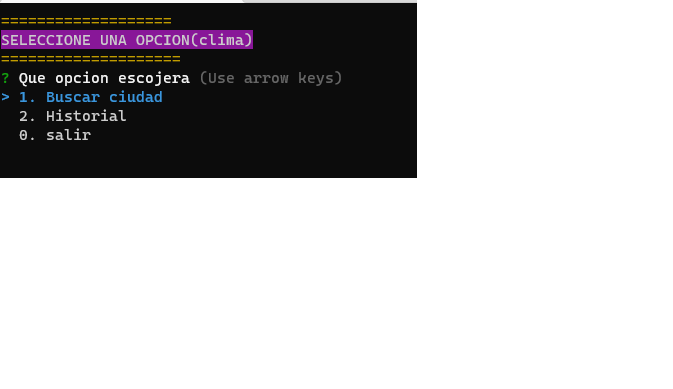
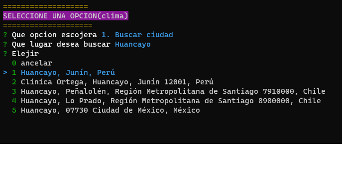
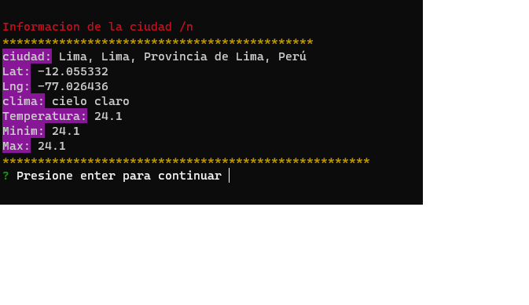
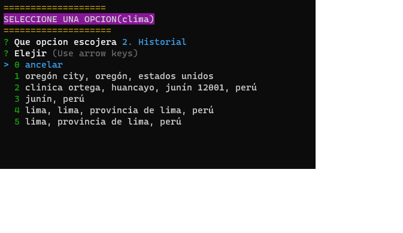

## PLANTILLA USADA
-[PLANTILLA USADA](#https://github.com/EL-BID/Plantilla-de-repositorio/blob/master/README.md)
-https://github.com/EL-BID/Plantilla-de-repositorio/blob/master/README.md

---
## OJO
Una vez descargado el archivo de GitHub se debe ejecutar el sgte comando
```js
npm install 
```
## APLICACION PARA VER EL CLIMA DE UNA CIUDAD
<h1 align="center"> Buscar lugar</h1>
<p align="center"></p> 
<p align="center"></p>
<hr>
<h1 align="center"> Obtener datos</h1>
<p align="center"></p> 
<h1 align="center"> Historial</h1>
<p align="center"></p> 

---
## OBSERVACIÓN
AL INICIAR UN PROYECTO ESCRIBIR 
```
npm init -y
```

---
## OBSERVACION
Código para leer datos:

```js
const readline = require('node:readline');
const { stdin: input, stdout: output } = require('node:process');

const rl = readline.createInterface({ input, output });

rl.question('What do you think of Node.js? ', (answer) => {
  // TODO: Log the answer in a database
  console.log(`Thank you for your valuable feedback: ${answer}`);

  rl.close();
});
```
## A LA HORA DE SUBIR UN PROYECTO CONSIDEREMOS
---
<p align="center">Configurar:</p>
<p align="center"></p>

---
## A LA HORA DE SUBIR A GITHUB TENER EN CUENTA

```js
EN .gitignore PONER node_modules/
```

---
## TRABAJAMOS CON EL PAQUETE INQUIRER PARA HACER MENUS INTERACTIVOS Y OTROS MAS

- [PAQUETE INQUIRER](https://www.npmjs.com/package/inquirer)
- [PAQUETE CHALK](https://www.npmjs.com/package/chalk)
- [PAQUETE AXIOS](https://www.npmjs.com/package/axios)
```JS
import axios from 'axios';
//const axios = require('axios'); // legacy way

// Make a request for a user with a given ID
axios.get('/user?ID=12345')
  .then(function (response) {
    // handle success
    console.log(response);
  })
  .catch(function (error) {
    // handle error
    console.log(error);
  })
  .finally(function () {
    // always executed
  });
```


